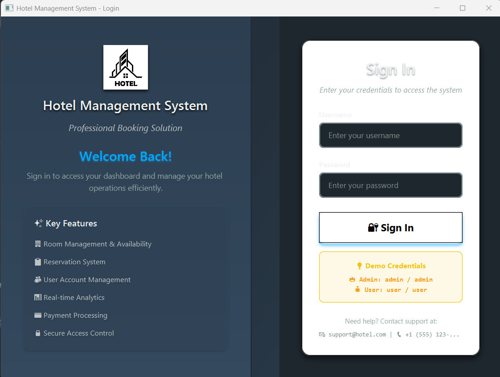
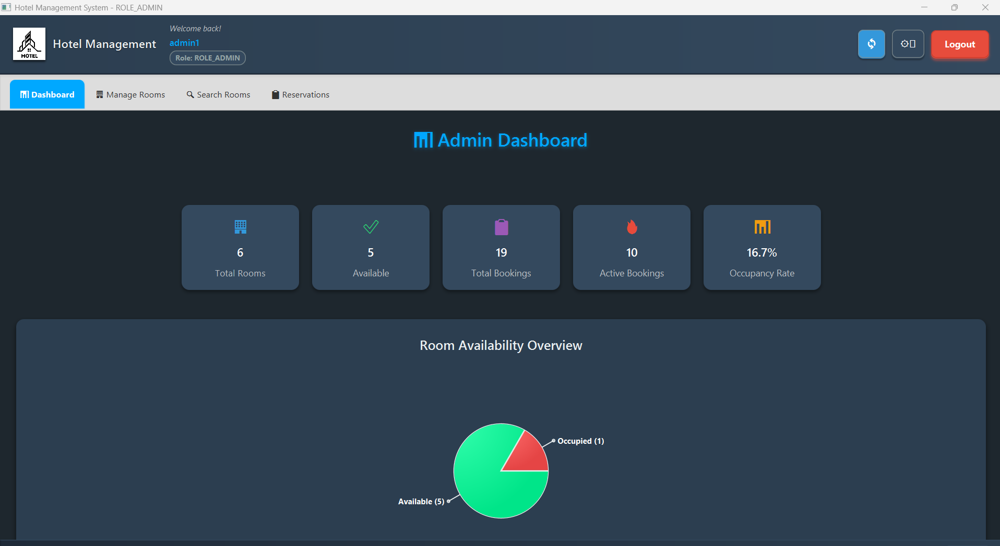
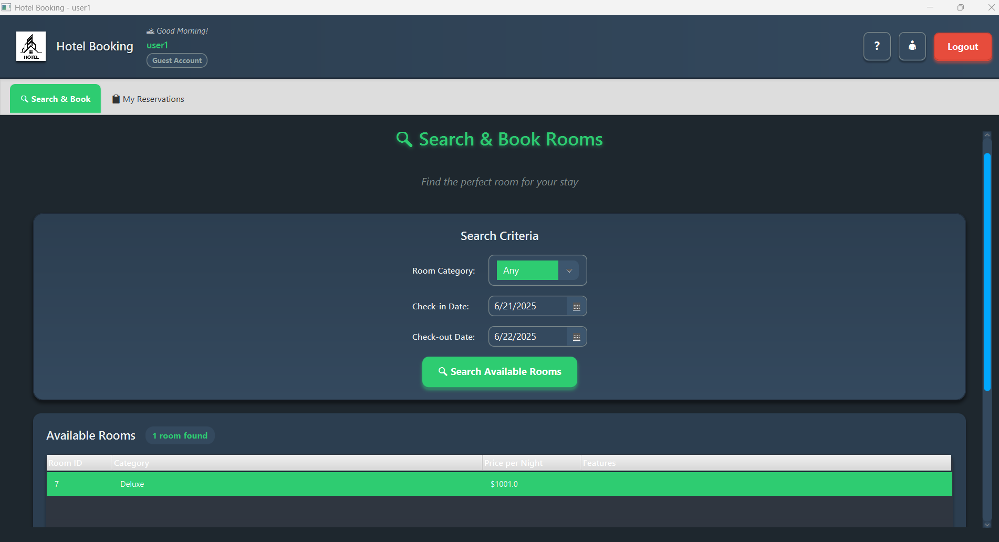

# Hotel Reservation System

This is a hotel booking and management system developed as part of the **CodeAlpha Java Internship – Task 4**. It features a modern JavaFX user interface and a secure Spring Boot backend with MySQL for data persistence. The system enables both administrators and users to interact with hotel data, including room listings, reservations, and booking history.

> 🔐 The application is secured with **JWT-based authentication** and uses **RESTful APIs** to connect the frontend and backend.

---

## ✨ Features

### 👤 User
- Search available rooms by:
  - Category (Standard, Deluxe, Suite)
  - Date range
  - Price range
- Book a room through the JavaFX interface
- View and cancel personal reservations
- Receive a simulated payment confirmation/receipt

### 🛠️ Admin
- Add new hotel rooms with detailed info
- View all rooms (available & unavailable)
- Book a room manually for a customer
- View and cancel any reservation
- Edit room details and toggle payment status
- View dashboard statistics:
  - Total rooms
  - Active bookings
  - Total reservations
  - Available room count

---

## 🔒 Security & Architecture

- 🧩 **JWT Authentication** – Secures all backend endpoints
- 🌐 **Spring Boot REST API** – Backend services accessible via HTTP
- 🖥️ **JavaFX GUI** – Desktop interface consuming backend APIs
- 🗃️ **MySQL** – Persistent data storage using Spring Data JPA

---

## 🛠️ Technologies Used

| Layer       | Technologies                                |
|-------------|---------------------------------------------|
| Frontend    | JavaFX, CSS, SceneBuilder                   |
| Backend     | Spring Boot, Spring Security, Spring MVC    |
| Database    | MySQL, Spring Data JPA                      |
| Security    | JWT, Password encryption                    |
| Build Tool  | Maven                                       |
| Dev Tools   | IntelliJ IDEA, GitHub Desktop               |

---

## 📂 Project Structure

```
Hotel-Reservation-System/
├── src/
│   └── main/
│       ├── java/com/example/demo/
│       │   ├── controller/          # REST API controllers
│       │   ├── model/              # Entity classes
│       │   ├── repository/         # Data access layer
│       │   ├── service/            # Business logic
│       │   ├── security/           # JWT & authentication
│       │   └── ui/                 # JavaFX scenes
│       └── resources/
│           ├── application.properties
│           └── styles/             # CSS for JavaFX
├── database_schema.sql             # MySQL database setup
├── README.md
├── pom.xml
└── mvnw / mvnw.cmd                # Maven wrapper
```

---

## ⚙️ Getting Started

### 📋 Prerequisites
- Java 11 or higher
- MySQL 8.0+
- Maven 3.6+
- JavaFX SDK (if not using Maven dependency)

### 🗃️ 1. Set Up the Database

Create the database using the provided SQL script:

```bash
# Create database and run schema
mysql -u root -p
CREATE DATABASE hotel_reservation_db;
USE hotel_reservation_db;
SOURCE database_schema.sql;
```

### ⚙️ 2. Configure Application

Update `src/main/resources/application.properties`:

```properties
# Database Configuration
spring.datasource.url=jdbc:mysql://localhost:3306/hotel_reservation_db
spring.datasource.username=your_username
spring.datasource.password=your_password
spring.datasource.driver-class-name=com.mysql.cj.jdbc.Driver

# JPA Configuration
spring.jpa.hibernate.ddl-auto=update
spring.jpa.show-sql=true
spring.jpa.properties.hibernate.dialect=org.hibernate.dialect.MySQL8Dialect

# JWT Configuration
jwt.secret=your_jwt_secret_key
jwt.expiration=86400000

# Server Configuration
server.port=8080
```

### 🚀 3. Run the Spring Boot Backend

```bash
# Using Maven wrapper
./mvnw spring-boot:run

# Or using Maven directly
mvn spring-boot:run
```

Backend will start on `http://localhost:8080`

### 🎯 4. Launch the JavaFX Frontend

1. Open the project in your IDE (IntelliJ IDEA recommended)
2. Run `Main.java` or `LoginScene.java`
3. Use the default credentials below to log in

### 🔐 Default Login Credentials

- **Admin**: `admin@hotel.com` / `admin123`
- **User**: `user@hotel.com` / `user123`

---

## 🌐 API Documentation

### Authentication
| Method | Endpoint      | Description                    | Status Codes |
|--------|---------------|--------------------------------|--------------|
| POST   | `/auth/login` | Authenticate and get JWT token | 200, 401     |

### Rooms
| Method | Endpoint              | Description              | Status Codes |
|--------|-----------------------|--------------------------|--------------|
| GET    | `/api/rooms/available`| Search available rooms   | 200, 400     |
| GET    | `/api/rooms/count`    | Total rooms for dashboard| 200          |
| POST   | `/api/rooms`          | Add new room (Admin)     | 201, 400, 403|

### Reservations
| Method | Endpoint              | Description              | Status Codes |
|--------|-----------------------|--------------------------|--------------|
| POST   | `/api/reservations`   | Book a room              | 201, 400, 403|
| GET    | `/api/reservations`   | Get user's reservations  | 200, 403     |
| DELETE | `/api/reservations/{id}` | Cancel a reservation  | 200, 403, 404|

> 🔑 **Authentication Required**: All protected routes require the `Authorization: Bearer <token>` header.

---

## 📸 Screenshots

### Login Interface


### Admin Dashboard

*Admin can manage rooms, view all reservations, and access system statistics*

### User Dashboard

*Users can search rooms, make reservations, and view booking history*

## 🚨 Troubleshooting

### Common Issues

**Database Connection Failed**
- Verify MySQL server is running
- Check database credentials in `application.properties`
- Ensure database `hotel_reservation_db` exists

**JavaFX Application Won't Start**
- Verify JavaFX runtime is properly configured
- Check if Java version is 11 or higher
- Ensure JavaFX modules are included in module path

**JWT Authentication Errors**
- Confirm backend server is running on port 8080
- Check if JWT secret is properly configured
- Verify login credentials are correct

**Maven Build Issues**
```bash
# Clean and rebuild
./mvnw clean install

# Skip tests if needed
./mvnw clean install -DskipTests
```

---

## 🔮 Future Enhancements

- Email notifications for booking confirmations
- Payment gateway integration
- Mobile app companion
- Advanced reporting and analytics
- Multi-language support
- Room availability calendar view

---

## 📄 License

This project was developed for educational purposes as part of the CodeAlpha Internship. Feel free to use or modify it for learning and demonstrations.

---

## 🙋‍♂️ Author

**Hasan Kanso**  
Developed for the CodeAlpha Java Internship

📧 Contact: Kansohasan@outlook.com 
🔗 LinkedIn: www.linkedin.com/in/hasan-kanso-
🐱 GitHub: HassanKanso21

---

## 🌟 Acknowledgments

- CodeAlpha for the internship opportunity
- Spring Boot and JavaFX communities for excellent documentation
- Contributors and reviewers who helped improve this project